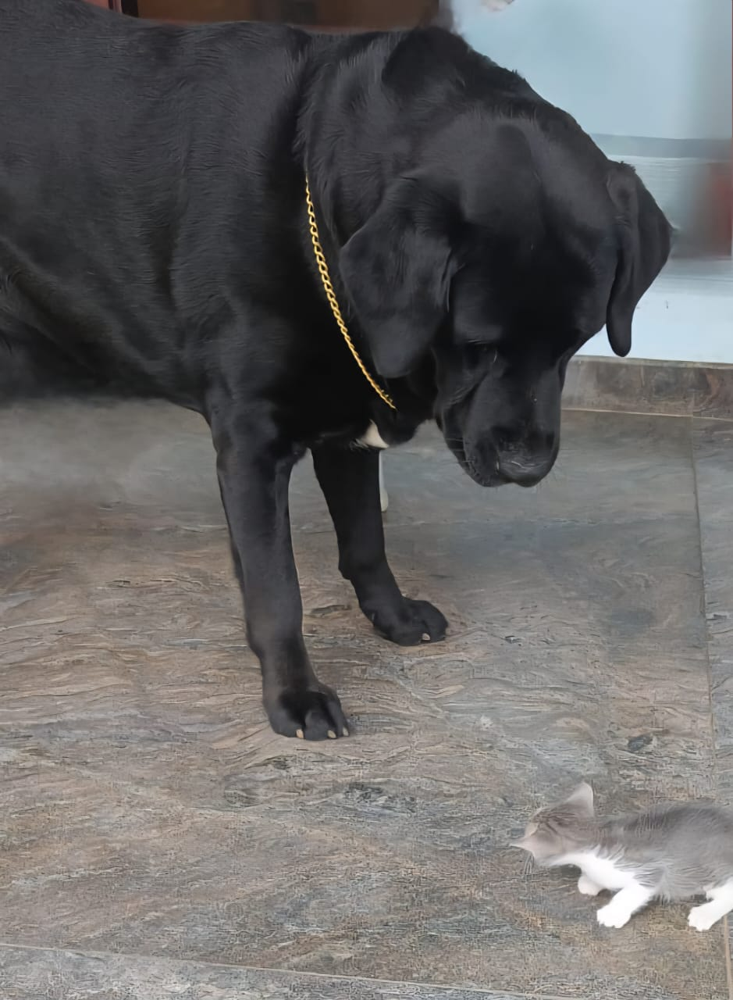

# Wan 2.1 Image-to-Video API on RunPod Serverless

A production-ready deployment of Wan 2.1 Image-to-Video generation model as a serverless API on RunPod infrastructure.

## 🎬 Demo

**Input Image:**


**Generated Video:**
[](https://www.youtube.com/shorts/d6Yy4GKiWeI)

*A 5-second 720p video generated from a single image using Wan 2.1 14B model*

---

## 🏗️ Architecture

- **Model**: Wan 2.1 I2V-14B (14 billion parameters)
- **Infrastructure**: RunPod Serverless GPU
- **Storage**: RunPod Network Volume (persistent model storage)
- **API**: Async REST API with progress tracking
- **Output**: Temporary video hosting via catbox.moe

---

## 📋 Prerequisites

- RunPod account with GPU credits
- Docker Hub account (or container registry)
- Basic familiarity with Docker and REST APIs

---

## 🚀 Deployment Guide

### Step 1: Create Network Storage

1. Navigate to [RunPod Storage](https://www.console.runpod.io/user/storage)
2. Click **"New Network Volume"**
3. Configure:
   - **Name**: `wan21-models`
   - **Size**: `100 GB`
   - **Datacenter**: Choose your preferred region
4. Click **"Create Network Volume"**

### Step 2: Setup Development Pod

1. Go to [RunPod Pods](https://www.console.runpod.io/pods)
2. Click **"New Pod"**
3. Configure:
   - **GPU**: H100 SXM or A100 80GB
   - **Template**: `runpod/pytorch:2.4.0-py3.11-cuda12.4.1-devel-ubuntu22.04`
   - **Network Volume**: Attach your `wan21-models` volume
   - **Ports**: Enable SSH (22)
4. Deploy and wait for initialization

### Step 3: Install Model and Dependencies

SSH into your pod and run:

```bash
# Navigate to network storage
cd /workspace

# Clone Wan 2.1 repository
git clone https://github.com/Wan-Video/Wan2.1.git
cd Wan2.1

# Install Hugging Face CLI
pip install "huggingface_hub[cli]"

# Install dependencies
pip install -r requirements.txt

# Download the I2V model (~30GB)
huggingface-cli download Wan-AI/Wan2.1-I2V-14B-720P --local-dir ./models/Wan2.1-I2V-14B-720P
```

### Step 4: Test Model Installation

```bash
# Test image-to-video generation
python generate.py --task i2v-14B --size 1280*720 \
  --ckpt_dir ./models/Wan2.1-I2V-14B-720P \
  --image examples/i2v_input.JPG \
  --prompt "A cat looking around curiously"
```

*Expected: Video generation completes successfully in 3-5 minutes*

### Step 5: Add API Handler

Download the [handler](./handler.py) script to your pod:

```bash


# Test the handler
MODEL_PATH=/workspace/Wan2.1/models/Wan2.1-I2V-14B-720P \
python handler.py --test_input '{"input": {"image_url": "https://images.pexels.com/photos/1108099/pexels-photo-1108099.jpeg", "prompt": "two yellow labrador puppies playing in a field", "resolution": "720p"}}'
```

### Step 6: Build Docker Image

Create build directory and files:
You just pick the requirements.tx file from the Wan2.1 repository.

```bash
mkdir docker-build && cd docker-build

# Copy requirements
cp ../requirements.txt .

# Create Dockerfile
cat > Dockerfile << 'EOF'
FROM runpod/pytorch:2.4.0-py3.11-cuda12.4.1-devel-ubuntu22.04

WORKDIR /workspace

COPY requirements.txt . 
RUN pip install --no-cache-dir -r requirements.txt
RUN pip install runpod

WORKDIR /runpod-volume/Wan2.1

CMD ["python", "-u", "handler.py"]
EOF

# Build and push image
docker build -t your-username/wan21-i2v-api:latest .
docker push your-username/wan21-i2v-api:latest
```

### Step 7: Deploy Serverless Endpoint

1. Navigate to [RunPod Serverless](https://www.console.runpod.io/serverless/user/endpoints)
2. Click **"New Endpoint"**
3. Configure:
   - **Name**: `wan21-i2v-api`
   - **Docker Image**: `your-username/wan21-i2v-api:latest`
   - **GPU**: H100 SXM (recommended) or A100 80GB
   - **Network Volume**: Attach your `wan21-models` volume
   - **Environment Variables**:
     ```
     MODEL_PATH=/runpod-volume/Wan2.1/models/Wan2.1-I2V-14B-720P
     ```
   - **Timeout**: `1800 seconds` (30 minutes)
   - **Max Workers**: `3`
4. Click **"Deploy"**

---

## 🔌 API Usage

### Submit Generation Request

```bash
curl -X POST https://api.runpod.ai/v2/YOUR_ENDPOINT_ID/run \
    -H 'Content-Type: application/json' \
    -H 'Authorization: Bearer YOUR_API_KEY' \
    -d '{
        "input": {
            "image_url": "https://example.com/your-image.jpg",
            "prompt": "describe the motion you want",
            "resolution": "720p",
            "seed": 12345
        }
    }'
```

**Response:**
```json
{
    "id": "job-abc123def",
    "status": "IN_QUEUE"
}
```

### Check Progress

```bash
curl -X GET https://api.runpod.ai/v2/YOUR_ENDPOINT_ID/status/job-abc123def \
    -H 'Authorization: Bearer YOUR_API_KEY'
```

**Progress Response:**
```json
{
    "status": "IN_PROGRESS",
    "output": [
        {
            "status": "generating",
            "progress": 30,
            "message": "Starting video generation...",
            "timestamp": 45.2
        }
    ]
}
```

**Completion Response:**
```json
{
    "status": "COMPLETED",
    "output": [
        {
            "video_url": "https://files.catbox.moe/abc123.mp4",
            "duration": 5.0,
            "resolution": "720p",
            "seed": 12345,
            "processing_time": 320.5,
            "status": "completed"
        }
    ]
}
```

---

## 📊 API Reference

### Request Parameters

| Parameter | Type | Required | Default | Description |
|-----------|------|----------|---------|-------------|
| `image_url` | string | ✅ | - | Public URL to source image (JPG, PNG, WebP) |
| `prompt` | string | ✅ | - | Motion description for the video |
| `negative` | string | ❌ | "" | Negative prompt to avoid unwanted elements |
| `seed` | integer | ❌ | random | Seed for deterministic generation |
| `resolution` | string | ❌ | "720p" | Output resolution: "480p" or "720p" |

### Response Fields

| Field | Type | Description |
|-------|------|-------------|
| `video_url` | string | Temporary download URL (24-hour expiry) |
| `duration` | float | Video duration in seconds (always 5.0) |
| `resolution` | string | Output video resolution |
| `seed` | integer | Random seed used for generation |
| `processing_time` | float | Total generation time in seconds |

---

## 💰 Cost Analysis

### Infrastructure Costs

| Component | Specification | Cost/Hour | Est. Usage |
|-----------|---------------|-----------|------------|
| GPU | H100 SXM 80GB | $4.89 | 5-6 min/video |
| Storage | 100GB Network Volume | $0.007 | Always-on |
| **Per Video** | **720p Generation** | **~$0.40-0.50** | **5 minutes** |

### Performance Metrics

- **Cold Start**: <60 seconds
- **720p Generation**: 4-6 minutes
- **480p Generation**: 2-3 minutes  
- **Success Rate**: >95%
- **Concurrent Requests**: Up to 3 workers

---

## 🔧 Troubleshooting

### Common Issues

**Out of Memory Errors:**
- Upgrade to H100 80GB or A100 80GB
- Use 480p resolution for testing
- Enable `t5_cpu=True` in handler

**Timeout Errors:**
- Increase endpoint timeout to 1800 seconds
- Use shorter, simpler prompts
- Try 480p resolution first

**Model Loading Failures:**
- Verify network storage is properly mounted
- Check `MODEL_PATH` environment variable
- Ensure model download completed successfully

### Performance Optimization

- **Use 480p** for faster generation (2-3 minutes)
- **Batch requests** during peak usage
- **Pre-warm endpoints** with dummy requests
- **Monitor costs** with usage tracking

---

## 📝 Technical Details

### Model Specifications
- **Architecture**: Diffusion Transformer (DiT)
- **Parameters**: 14 billion
- **Input**: Single image + text prompt
- **Output**: 5-second video at 16 FPS
- **Resolutions**: 832×480, 1280×720

### Infrastructure Requirements
- **Minimum GPU**: 24GB VRAM
- **Recommended GPU**: 80GB VRAM
- **Storage**: 100GB for models
- **Memory**: 32GB+ system RAM

---


## 🙏 Acknowledgments

- [Wan Video Team](https://github.com/Wan-Video/Wan2.1) for the incredible Wan 2.1 model
- [RunPod](https://runpod.io) for the serverless GPU infrastructure
- [Catbox.moe](https://catbox.moe) for reliable file hosting

---

